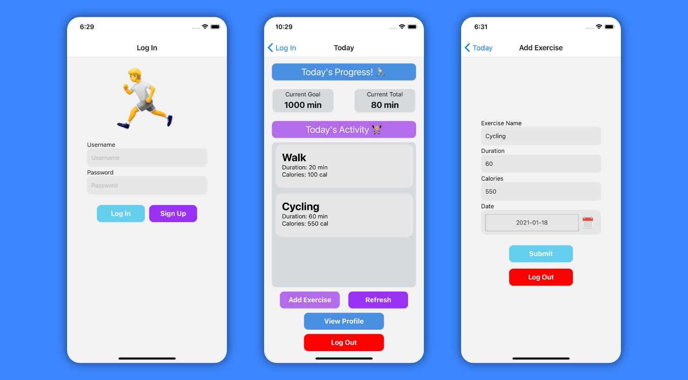

# Workout-tracker

## Description 
Better Me is a fitness based webpage giving users the ability to find, share, and track workouts with other users. 
## Table of Contents
- [Workout-tracker](#workout-tracker)
  - [Description](#description)
  - [Table of Contents](#table-of-contents)
  - [Acceptance Criteria](#acceptance-criteria)
  - [Technology Used](#technology-used)
  - [Images](#images)
  - [Further Development](#further-development)
  - [Contributions](#contributions)
  - [Deployed Link](#deployed-link)
## Acceptance Criteria
- 
  
## Technology Used
- React
- Node.js/ Express.js
- MongoDB/ Mongoose ODM
- Render
- Web API
## Images
- 
- 

## Further Development 

## Contributions
- Aldo- API
- Chris M- Queries 
- Hasani- Node, Express, React, and Readme
- Marcos- React  
- Everyone- seeding the website, testing, 
## Deployed Link